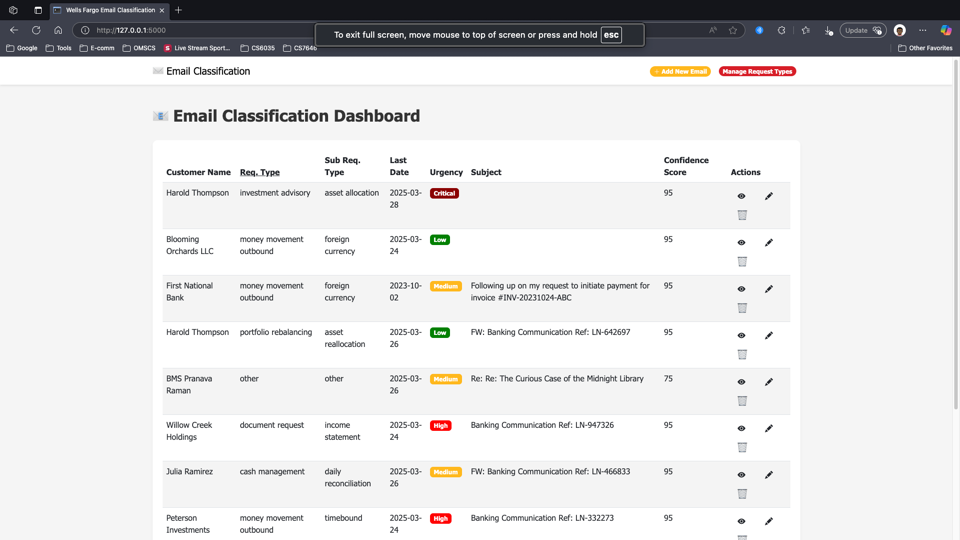
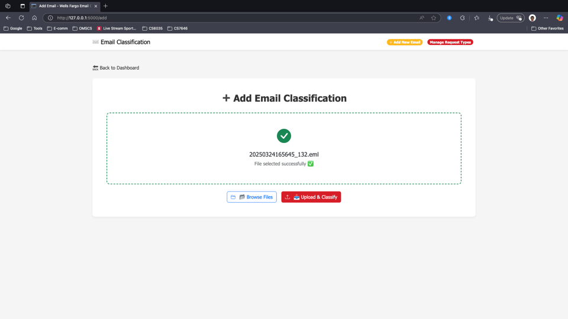
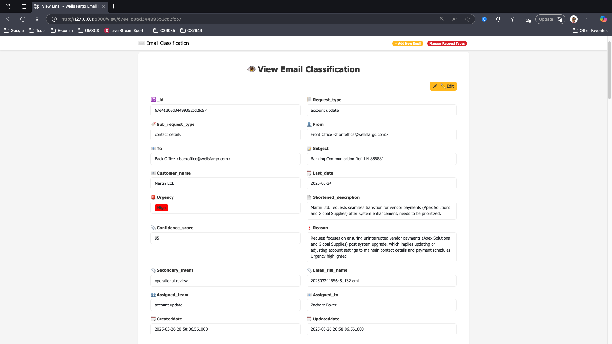
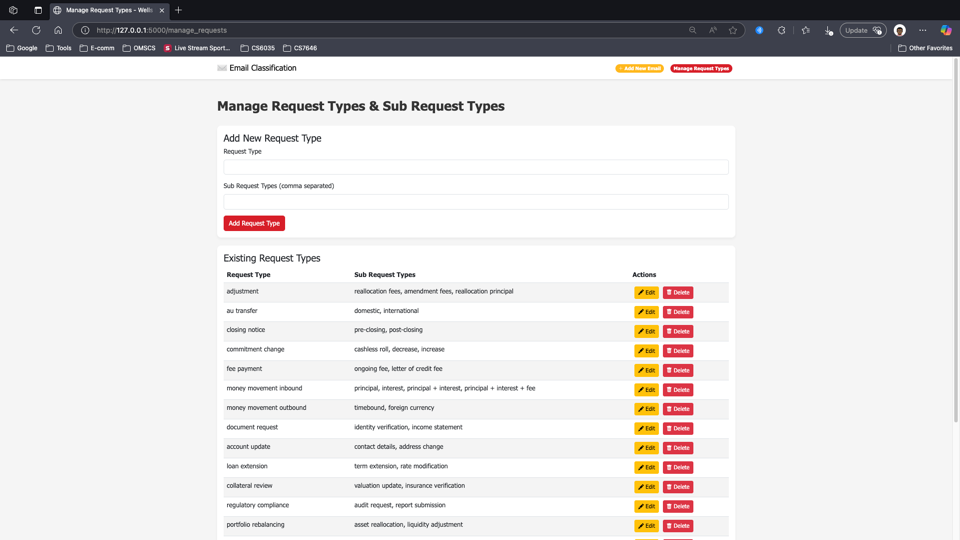
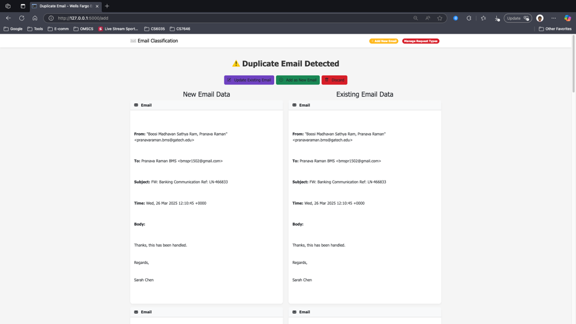

# 🚀 Gen-AI Based Email Classification and OCR Solution

## 📌 Table of Contents
- [Introduction](#introduction)
- [Demo](#demo)
- [Inspiration](#inspiration)
- [What It Does](#what-it-does)
- [How We Built It](#how-we-built-it)
- [Challenges We Faced](#challenges-we-faced)
- [How to Run](#how-to-run)
- [Tech Stack](#tech-stack)
- [Team](#team)

---

## 🎯 Introduction
This project is an email classification system that processes emails, extracts relevant information, and classifies them into customizable request types and sub request types.
It includes functionalities for managing request types and sub-request types, viewing and editing email classifications, and handling attachments.


## 🎥 Demo
📹 [Video Demo](https://drive.google.com/file/d/1ZKUpTCh6rcq9mi-sLfSjJ1GYdYWwIhTN/view) 

📺 [Slideshow explaining architecture](artifacts/arch/Gen-AI_Based_Email_Classification_and_OCR_Solution.pptx)

📄 [High Level Design Document](artifacts/arch/Design_Document.pdf)

🖼️ Screenshots:

Home Page:-


Uploading Email (it can be .eml, .pdf, .txt or .docx file):-


Email classification details, the request type, sub request type gets set to one of the configurable types and the most semantically closer type is saved in the db.


User can customize the request and sub-request types:-


In case of a duplicate request, or a request that is in reply to an existing email, the classifier detects the duplicate email and asks the user to either update existing, add as new request or discard the request.



## 💡 Inspiration
The project was conceived in response to the critical need for efficient and reliable email classification within high-volume, regulated industries. The challenges associated with manually sorting and processing large quantities of customer emails—particularly in environments where compliance and accuracy are paramount—necessitated an automated solution. 
## ⚙️ What It Does
This system addresses the complexities of email management by extracting relevant information, classifying messages according to predefined request types and sub-request types, and mitigating issues such as duplicate processing. In doing so, the project contributes to streamlining operational workflows and enhancing overall service delivery.
## 🛠️ How We Built It
- The project leverages Google's "Gemini" LLM to perform extraction and semantic mapping of the email content to the extraction parameters.
- The application is a Flask Endpoint, capable of being run both as UI application and as a REST API endpoint.
- The database is a MongoDB instance, which stores the email classification data.
- The UI is built using HTML, CSS, Javascript and Bootstrap.


## 🚧 Challenges We Faced
The major challenge faced was lack of training data for the model. 
We utilized LLM to create our own dataset of various types of emails.
Each of the email created will mimic a real customer interaction with a front-office, who will be forwarding to the classifier.

The code for generating the emails is present in `code/src/emailgen.py` .


## 🏃 How to Run
1. Clone the repository  
   ```sh
   git clone https://github.com/ewfx/gaied-gen-ai-bots.git
   ```
2. Install dependencies  
   ```sh
   pip install -r requirements.txt 
   ```
3. Install Tesseract OCR from this link: https://tesseract-ocr.github.io/tessdoc/Downloads.html

4. Create a mongodb database (either local or Atlas) and get the connection string.
5. Create a `.env` file with the following data
    ```sh
    MONGO_DB_URI=<your_mongodb_uri>
    GEMINI_API_KEY=<your_gemini_api_key>
    TESSERACT_CMD=<path_to_tesseract_executable>
    ```
6. Run the flask application by going in to the `code/src/persist_db` directory and running the following command:
   ```sh
   python app.py
   ```

7. Open the browser and go to `http://localhost:5000` to access the application.

8. To create the initial database, run the following command:
   ```sh
   python dropdownvalues.py
   ```
   
9. To generate test emails, run the following command in `code/src` directory:
   ```sh
    python emailgen.py
    ```
   
## 🏗️ Tech Stack
- 🔹 Frontend: HTML / CSS / JavaScript / Bootstrap
- 🔹 Backend: Flask
- 🔹 Database: MongoDB
- 🔹 LLM: Gemini

## 👥 Team
- **Pranava Raman BMS** - [GitHub](https://github.com/bmspr1502) | [LinkedIn](https://www.linkedin.com/in/pranava-raman-bms/)
- **Priya Harshini Ravichandran** - [GitHub](https://github.com/priyaharshini-ravi) | [LinkedIn](https://www.linkedin.com/in/priya-harshini-ravichandran-700a331b9/)
- **Veera Venkata Narayana** - [GitHub](https://github.com/pvvnarayana) | [LinkedIn](https://www.linkedin.com/in/pvvnarayana/)
- **Suresh Bankuru** - [GitHub](https://github.com/sureshbankuru) | [LinkedIn](https://www.linkedin.com/in/suresh-bankuru-986b4b45/)
- **Venkata Rangarao Kanta** - [GitHub](https://github.com/rangakv) | [LinkedIn](#)